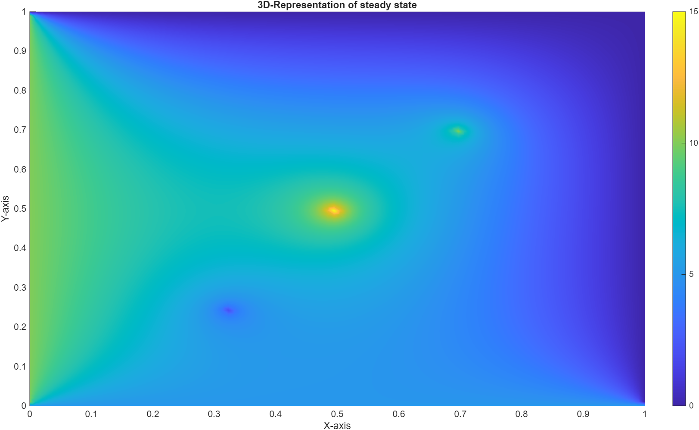
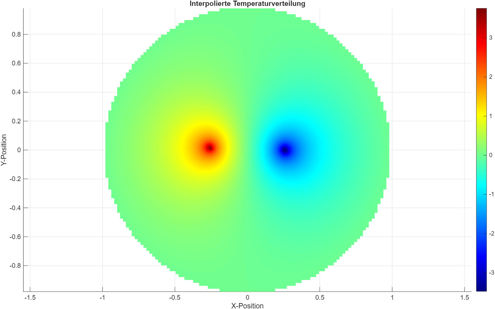

# 2D-Steady-State Heat Equation Solver (PDE-Solver)

## Project Description
This project implements a numerical solver for the steady-state heat equation using relaxation methods. It allows the user to define the number of nodes, the length of the domain, and boundary conditions to compute the temperature distribution across a 2D-mesh. Cartesian and Polar coordinate-systems are supported. 

The equation solved is:
$$ \frac{∂²T}{∂x²} + \frac{∂²T}{∂y²} = 0 .$$
The solver uses the Gauss-Seidel method to iteratively update the temperature values for the entire mesh until convergence is achieved or the maximum number of iterations is reached. Finally, the resulting temperature distribution is saved in a csv file for further use.

## Setup Instructions
### Prerequisites:
- C++ compiler (supporting C++23)
- Make or Ninja

### Setup:
1. Clone the repository
2. Create a build directory
3. Build the project

## Usage
1. Prepare the "config.ins"-file and have it in the same folder as your executable. (This is usually the "cmake-build-debug" folder.)
2. Run the executable (pde_solver.exe)
3. The program will then compute and output the temperature distribution to a file named "steady_state_sol.csv". The structure of the resulting output file is: (x_coord, y_coord, temperature).

The "config.ins"-file must be compliant to the instructions given in the exemplary "config.ins"-file, which is provided in the repository. These are:
1. Coordinate system (keyword: cs): polar or cartesian
2. Grid:
- for cartesian: number of nodes in x and y direction (nx, ny), and length of domain in x and y direction (lx, ly)
- for polar: number of nodes in radial and azimuthal direction (nr, na), and radius of domain (lr)
3. solver: max iterations (max_iter) and required tolerance between update steps to count as converged (tolerance)
4. boundary conditions
- for cartesian: bottom: y = 0 (t_bot); top: y = ly (t_top); left: x = 0 (t_left); right: x = lx (t_right)
- for polar: outside: r = lr (t_out);
5. inner boundary conditions:
- **first**: declare number of boundary conditions inside the grid (n_in_bc)           # need to write logic so as to not input n_in_bc
- second give coordinates and value of boundary condition:
  - for cartesian: x-coord y-coord value
  - for polar: radius angle(in radiant) value

## Example
### 1. Cartesian Coordinate-system 
Exemplary "config.ins"-file:
```
# Coordinate system:
cs cartesian
# Grid:
nx 100
ny 100
lx 1
ly 1
# solver:
max_iter 10000
tolerance 1e-6
# boundary conditions
t_bot 5.0
t_top 0.0
t_left 10.0
t_right 0.0
# inner boundary conditions:
n_in_bc 3
0.50 0.50 15.0
0.33 0.25 2.0
0.7 0.7 10.0
```
To visualize the solution, the saved file can be imported and plotted in a program of your liking (here: MATLAB):

### 2. Polar Coordinate-system
Exemplary "config.ins"-file:
```
# Coordinate system:
cs polar
# Grid:
nr 100
na 100
lr 1
# solver: 
max_iter 100000
tolerance 1e-6
# boundary conditions
t_out 0.0
# inner boundary conditions:
n_in_bc 2
0.25 0.0 -5.0
0.25 3.14 5.0
```


## How to extend or adapt the code to fit your project
We use a class based system for the solver. There are two main classes:
* io: handles in- and output
* pde_solver: structure for different solver cases/implementations

If you want to extend the code to handle other problems (e.g. 3D-solver, Finite Elements method), create a new class using the pde_solver as a parent. 
For single feature additions (e.g. other boundary conditions, implement transient equation, or use other methods etc..) implement new functions within the solver class. 
You may need to update the io-class, depending on your input/output-needs.

## Roadmap
The requirements for Sprint 1 were:
* working solver,
* output of steady-state solution to file,
* at least one unit test, 
* comprehensive `README.md` file.

The requirements for sprint 2 were: 
* different meshes loadable from directory,
* user-friendly, logical additional input,
* explanation on how to extend the code further.

The current code fulfills the requirements for sprint 3. This includes:
* observations and performance analysis, 
* at least three different optimization techniques applied and observed,
* the most optimized final code.

## Group 65
This project is the Bonus Project of Group 65 of the Advanced Programming lecture at TUM in the Wintersemester 2025/26.

Authors:
* Ridhin Paul
* Julius Sellmayer
