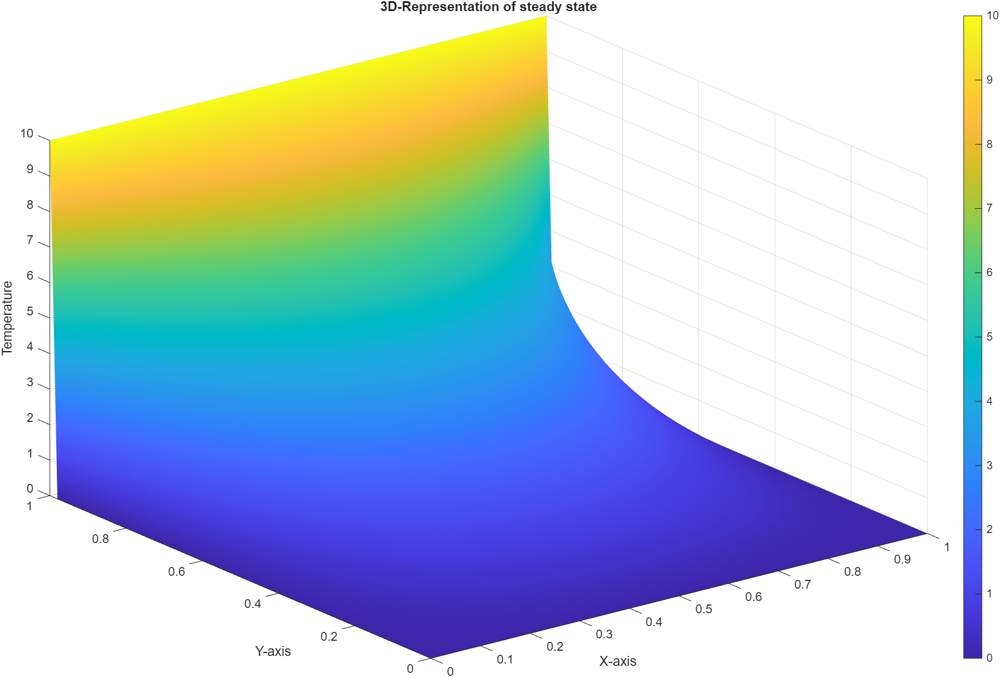
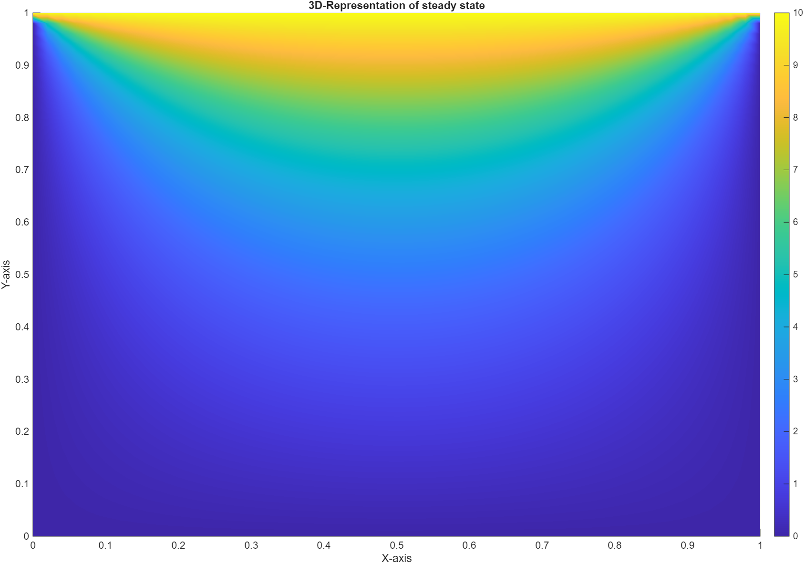

# 2D-Steady-State Heat Equation Solver (PDE-Solver)

## Project Description
This project implements a numerical solver for the steady-state heat equation using relaxation methods. It allows the user to define the number of nodes, the length of the domain, and boundary conditions to compute the temperature distribution across a 2D-mesh. 

The equation solved is:
$$ \frac{∂²T}{∂x²} + \frac{∂²T}{∂y²} = 0 .$$
The solver uses the Gauss-Seidel method to iteratively update the temperature values for the entire mesh until convergence is achieved or the maximum number of iterations is reached. Finally, the resulting temperature distribution is saved in a csv file for further use.

## Setup Instructions
### Prerequisites:
- C++ compiler (supporting C++23)
- Make or Ninja

### Setup:
1. Clone the repository
2. Create a build directory
3. Build the project

## Usage
When running the executable, "pde-solver.exe":
1. input the number of nodes in the x and y directions (must be greater than 2),
2. input the length of the domain in the x and y directions (must be greater than 0),
3. input the boundary conditions for the left, right, top, and bottom edges of the domain,
4. input the wanted tolerance for convergence (maximum difference between iterations for each node, greater than 0),
5. input the maximum number of iterations (must be greater than 0).
6. The program will then compute and output the temperature distribution to a file named "steady_state_sol.csv". The structure of the resulting output file is: (x_coord, y_coord, temperature).

## Example
```
Enter number of nodes in x-direction:
51
Enter number of nodes in y-direction:
51
Enter length in x-direction:
1
Enter length in y-direction:
1
Enter constant bottom boundary value (and corners):
0
Enter constant top boundary value (and corners):
10
Enter constant left boundary value:
0
Enter constant right boundary value:
0
Set required tolerance for convergence:
1e-5
Set maximum number of iterations for convergence:
20000
Steady state solver started
Required tolerance reached after 1200 iterations. Solution converged.
Solution succesfully saved to 'steady_state_sol.csv'.
Process finished with exit code 0
```
To visualize the solution, the saved file can be imported and plotted in a program of your liking (here: MATLAB):





## Roadmap
The current implementation fulfills the requirements for Sprint 1 of the Bonus Project, these are:
* working solver,
* output of steady-state solution to file,
* at least one unit test, 
* comprehensive `README.md` file.

For the 2nd Sprint the requirements are: 
* different meshes loadable from directory,
* user-friendly, logical additional input (if required),
* explanation on how to extend the code further.

In the third and last Sprint the performance of the code is improved. This includes:
* observations and performance analysis, 
* at least three different optimization techniques applied and observed,
* the most optimized final code.

## Group 65
This project is the Bonus Project of Group 65 of the Advanced Programming lecture at TUM in the Wintersemester 2025/26.

Authors:
* Narayan Adhikari
* Ridhin Paul
* Julius Sellmayer
