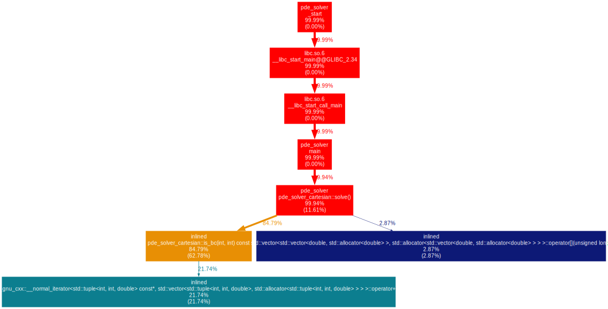
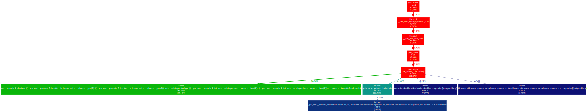
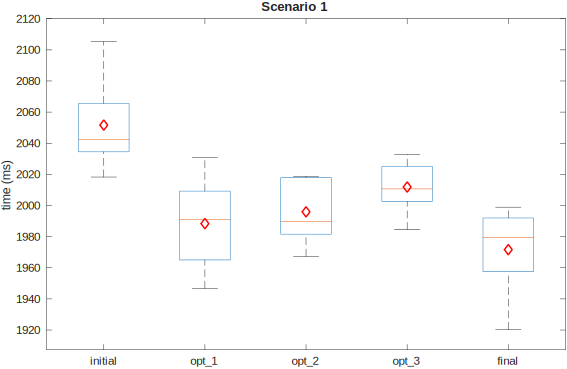
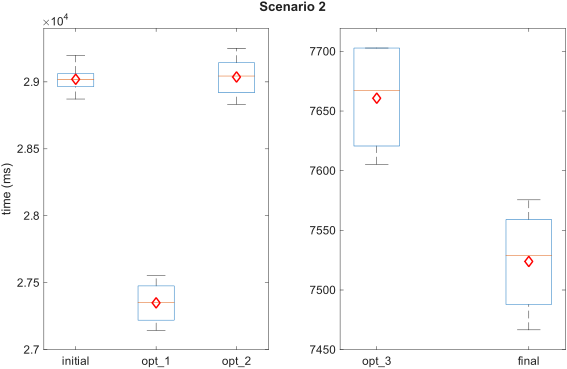
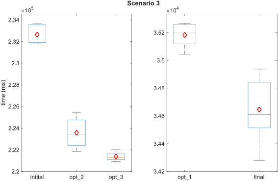
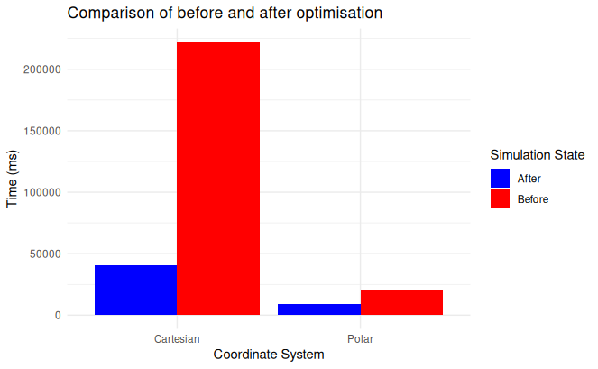
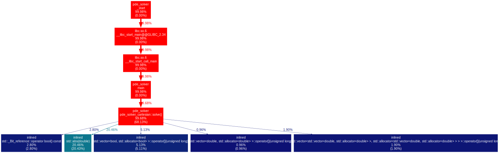
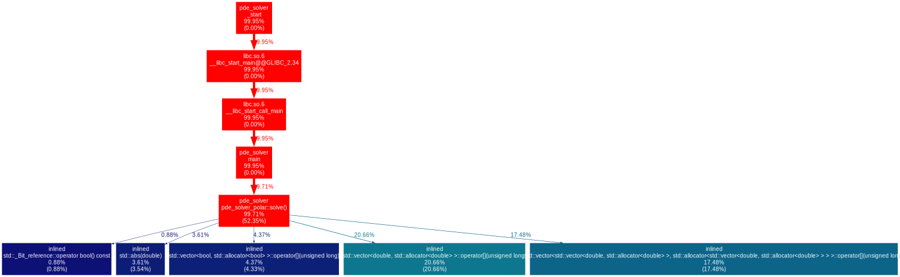

# Performance Analysis
## Method
To evaluate the computational efficiency and scalability of the solver, the performance was benchmarked using three distinct scenarios.
Initially, the unoptimized codebase was profiled using gprof.
The identified bottlenecks and computationally expensive methods were then targeted for optimization. Three specific optimization steps were trialed and evaluated.
For evaluation, the scenarios were each run five times on each optimization step, and the mean value was calculated to ensure statistical reliability.
Finally, the optimizations were combined into a final build to measure the cumulative performance improvement.

### Test Scenarios
The three scenarios used for evaluation are designed to push the limits of the solver by utilizing high-density meshes and large number of internal boundary conditions.
The three scenarios are:  
__1. Cartesian Coordinate System (Baseline)__
* Grid: Medium sized ($N_x, N_y = 200$)
* Conditions: 3 internal boundary conditions
* Purpose: Serves mainly for comparison to Scenario 2.

__2. Polar Coordinate System:__
* Grid: Medium sized ($N_x, N_y = 200$)
* Conditions: 3 internal boundary conditions
* Purpose: Benchmarked to observe the impact of coordinate transformations on solver convergence and runtime.

__3. Cartesian Coordinate System:__
* Grid: Large-scale ($N_x, N_y = 500$)
* Conditions: 80 internal boundary conditions
* Purpose: Designed to test memory throughput and cache efficiency under heavy iteration loads.

### Benchmarking tools

1. __Internal timer:__  A custom C++ Timer class (utilizing `std::chrono::steady_clock`) was injected into core solver 
functions. This provided high-precision time measurements of the "hot loops" in milliseconds (ms),
specifically tracking the time spent per iteration.
2. __System-level tool:__ The Linux perf utility was used to profile the execution at the kernel level. This allowed for the identification of CPU bottlenecks

## Profiling
The results of the profiling for the third scenario results in the call tree below:

As can be seen almost 85% of the runtime is used by one function (`is_bc`).  
The results of the profiling for the second scenario results in the call tree below:

Like in scenario 3, a big part of the runtime (almost 28%) is used by the `is_bc`-function. 

## Optimization
### Optimization 1: Boolean Mesh Mask
__Original:__ The solver updates only nodes that are not set to constant boundary conditions. This was achieved by checking
against a `std::vector` of tuples containing all inner boundary coordinates.
This required a linear search through the vector for every grid node in every iteration, an $O(n_{BC})$ operation.  
__Change:__ This search was replaced by a Boolean Mesh Mask. A secondary mesh of the same dimensions as the computational grid
was initialized with boolean values (false for boundary nodes, true for fluid nodes).  
__Impact:__ This transformed the boundary check into a constant-time $O(1)$ memory lookup. 
The performance gain scales linearly with the number of internal boundary conditions, 
making it particularly effective for complex setups like Scenario 3.

### Optimization 2: Precalculated Coefficients
__Original:__ For each update the compiler uses two coefficients in the cartesian coordinate system and four for the polar
coordinate system. These were recalculated for every update step.  
__Change:__ The coefficients are now precalculated once during the initialization phase. For the Polar system,
these radius-dependent values are stored in a `std::vector` (coefficient lookup), allowing the solver to retrieve them via
index during the iteration.  
__Impact:__ This eliminates thousands of redundant floating-point operations per iteration.

### Optimization 3: Loop Transformation
__Original:__ The polar solver used a single loop for the entire mesh with an internal if statement for the innermost
circle of nodes. Additionally, `std::fmod` was used to handle the wrap-around-logic for the first and last azimuthal elements.  
__Change:__ The loop is unrolled to handle the innermost circle and the first and last azimuthal elements separately.
This eliminates the need for the additional if statement and the `std::fmod`.  
__Impact:__ This loop transformation reduces the number of functions called and if statements evaluated for each iteration.

## Results
__Note on Results:__ 
* All measurements (initial, opt 1-3, final) were conducted with `-O3` compiler optimization. This reduces impact of optimization 2.
* Runtimes are system specific, all measurements were performed on one system.
* Polar system (scenario 2) requires greater number of iterations for convergence. (Scenario1: 12061, Scenario 2: 46063, Scenario 3: 33300)
* Optimization 3 builds on optimization 2. 
  
The measured runtimes for each scenario and optimization step are shown below:

The mean values are:

| Optimization stage | Scenario 1 | Scenario 2 | Scenario 3 |
| :--- | :---: | :---: | :---: |
| Initial code | 2051.7 ms | 29020 ms | 232640 ms |
| Optimization 1: Boolean Mesh Mask | 1988.4 ms | 27350 ms | 35180 ms |
| Optimization 2: Precalculated Coefficients | 1995.9 ms | 29037 ms | 223580 ms |
| Optimization 3: Loop Transformation | 2011.9 ms | 7661 ms | 221390 ms |
| Final code | 1971.6 ms | 7524 ms | 34650 ms |

### Final result comparing before and after all the optimisations

The implemented optimizations yielded a significant performance increase, resulting in an __81%__ reduction in total runtime for the Cartesian solver and a __55.43%__ reduction for the Polar solver.  

### Comparison of output from the perf tool

#### Cartesian solver

The transition from the initial baseline to the optimized implementation resulted in a drastic shift in the solver's execution profile. In the initial version (Before), 
the system was heavily bottlenecked by logic overhead, with 84.79% of the runtime consumed by the is_bc()  function and its associated iterator increments. 
By refactoring the boundary condition checks into (_isnt_bc) and applying optimizations, this overhead was eliminated. Consequently, the final profile (After) shows the CPU spending the majority of its cycles (68.13%) on core
PDE logic.

##### Before

  

##### After

#### Polar solver

The initial profile (Before) showed that 49.98% of the total runtime was consumed by expensive modulo arithmetic (fmod), 
in addition to the 27.72% overhead from boundary searches.
By optimizing the periodic logic to remove these fmod calls and refactoring the boundary checks, the final implementation (After) successfully eliminated these arithmetic stalls. 
This resulted in a 55.43% reduction in runtime (2.24x speedup).

##### Before

  

##### After

